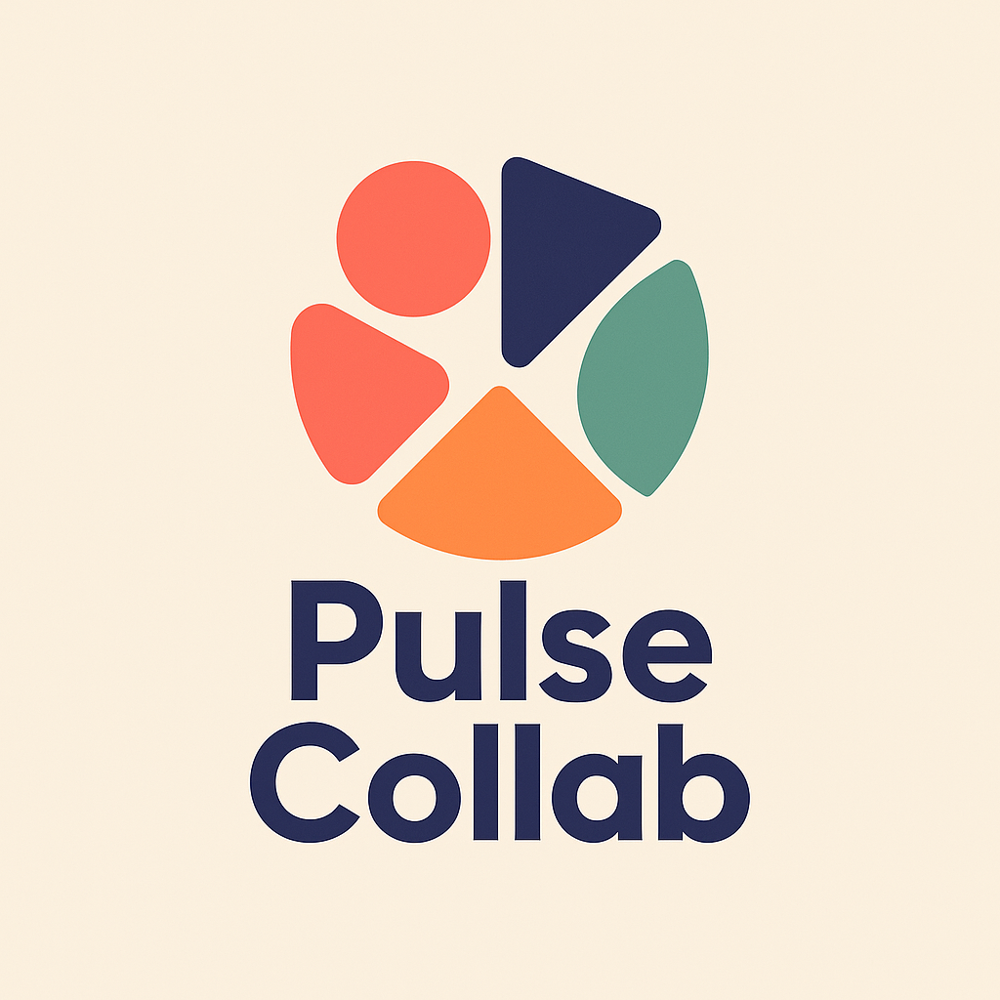

<!DOCTYPE html>
<html lang="en">
<head>
  <meta charset="UTF-8" />
  <meta name="viewport" content="width=device-width, initial-scale=1.0" />
  <title>The Momentum Reclaimer</title>
  
  <meta property="og:title" content="The Momentum Reclaimer" />
  <meta property="og:description" content="A self-guided workbook to reduce meeting bloat and reclaim deep work time—built for product teams and execs." />
  <meta property="og:image" content="social-preview.png" />
  <meta property="og:url" content="https://yonnastgetahun.github.io/momentum-audit-reclaimer/" />
  <meta name="twitter:card" content="summary_large_image" />
  
</head>
<body>
  

    
    

      <h1>📘 The Momentum Reclaimer</h1>
      
A self-guided audit to help product teams and execs reduce meeting bloat and reclaim deep work time.

    

    
<h2>Section 1: Your Context</h2><label for="role">Your Role & Responsibilities</label><textarea id="role"></textarea><label for="teamSize">Team Size</label><input type="text" id="teamSize" /><label for="deepWork">Weekly Deep Work Needs</label><textarea id="deepWork"></textarea><label for="frustrations">Biggest Meeting Frustration</label><textarea id="frustrations"></textarea>

    
<h2>Section 2: Top 5 Recurring Meetings</h2><textarea id="meetings" rows="5"></textarea>

    
<h2>Section 3: Quick Self-Check</h2><label><input type="checkbox" /> I lead most of these meetings</label><label><input type="checkbox" /> I attend but don’t contribute in half</label><label><input type="checkbox" /> I often multitask in meetings</label><label><input type="checkbox" /> I struggle to find focus time</label>

    
<h2>Section 4: Make Cuts</h2><label for="eliminate">Meetings to Eliminate</label><textarea id="eliminate"></textarea><label for="reduce">Meetings to Reduce</label><textarea id="reduce"></textarea><label for="convert">Meetings to Convert to Async</label><textarea id="convert"></textarea><label for="combine">Meetings to Combine</label><textarea id="combine"></textarea>

    
<h2>Section 5: Reclaim the Time</h2><label for="weekly">Time Reclaimed (per week)</label><input type="text" id="weekly" /><label for="monthly">Time Reclaimed (per month)</label><input type="text" id="monthly" /><label for="yearly">Time Reclaimed (per year)</label><input type="text" id="yearly" /><label for="reallocation">Where will you reinvest that time?</label><textarea id="reallocation"></textarea>

    
<h2>Section 6: New Rules of Engagement</h2><label for="runRules">Rules for Meetings You Run</label><textarea id="runRules"></textarea><label for="attendRules">Rules for Meetings You Attend</label><textarea id="attendRules"></textarea><label for="zones">Protected Zones</label><textarea id="zones"></textarea>

    
<h2>Section 7: Executive Summary</h2><label for="summaryWins">Top Wins / Calendar Changes</label><textarea id="summaryWins"></textarea><label for="impact">Team Impact / Morale Change</label><textarea id="impact"></textarea><label for="roi">Estimated ROI or Time Saved</label><textarea id="roi"></textarea><label for="nextSteps">Recommended Next Steps</label><textarea id="nextSteps"></textarea>

    

      
🔗 Visit <a href="https://pulsecollabagency.com/" target="_blank" style="color: var(--secondary); text-decoration: underline;">pulsecollabagency.com</a> 
      📬 <a href="mailto:contact@pulsecollabagency.com" style="color: var(--secondary); text-decoration: underline;">contact us</a>

    

    

      <button class="btn" onclick="generatePDF()">📥 Download My Audit as PDF</button>
    

  

  
</body>
</html>

